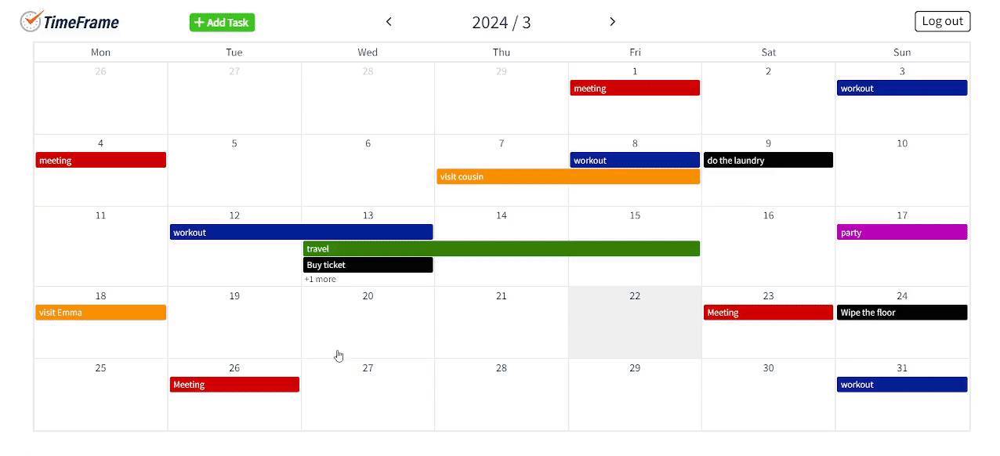
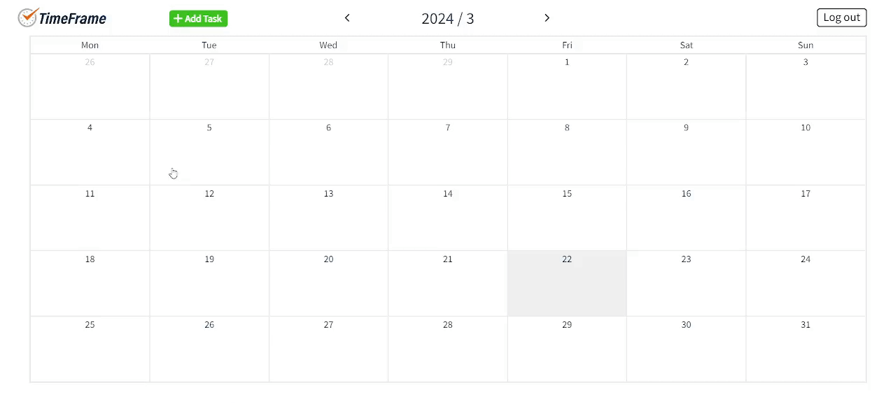

# TimeFrame is an online calendar tool that clearly records your daily schedule!

## Link https://timeframe-ef8c5.web.app/

 

## Classify different tasks by color.

 

## Click and select the period then release the mouse to add a task.

 

## Click on the date and hold down the mouse until the window popup to add a specific date task.

 

## DEMO Video

